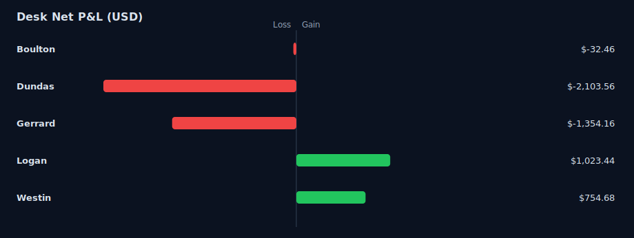

# Tiverton Trades - Public Audit Trail

**Immutable trade event log from the Tiverton House multi-agent trading system.**

This repository provides cryptographically verifiable proof of all trading activity. Every trade action is logged with git commit timestamps that cannot be backdated or modified.

## What This Is

A multi-agent AI trading system where four independent agents (Westin, Logan, Gerrard, Dundas) propose trades to an AI coordinator (Tiverton) for approval and execution.

Every trade action is logged in `trade-audit.json`:
- **trade_id**: Unique identifier (agent-timestamp)
- **event_type**: Action taken (PROPOSED, CONFIRMED, APPROVED, DENIED, FILLED, FAILED, CANCELLED, PASSED)
- **actor**: Who performed the action (agent name or coordinator)
- **details**: Additional context (thesis, fill price, error messages)
- **created_at**: Timestamp (UTC)

## Why This Matters

Trading results are easy to fake. Screenshots can be doctored. Timestamps can be fabricated.

This audit trail makes retroactive editing impossible:
1. **Git commit hashes** - Cryptographically link each commit to its timestamp
2. **Archive.org snapshots** - Independent third-party timestamps via Wayback Machine
3. **Append-only log** - Events are never modified or deleted
4. **Automatic archival** - Updates pushed immediately after execution and archived
5. **Public verification** - Anyone can cross-reference with broker API

## Verification

To verify a trade is real and wasn't backdated:

1. **Find the trade** in `trade-audit.json` (look up the trade_id)
2. **Check git commit timestamp** - When it was recorded on GitHub
3. **Check archive.org snapshot** - Independent third-party timestamp:
   - https://web.archive.org/web/*/https://raw.githubusercontent.com/mostlydev/tiverton-trades/main/trade-audit.json
   - The trade should appear in snapshots dated at or after the trade timestamp
4. **Verify event sequence** - PROPOSED → CONFIRMED → APPROVED → FILLED makes sense

### Why Archive.org Matters

Even if someone rewrites git history with `git push --force`, archive.org has permanent snapshots showing what the file looked like at specific times. This prevents:
- Backdating trades
- Adding profitable trades retroactively
- Deleting losing trades

For detailed verification instructions, see [VERIFICATION.md](VERIFICATION.md).

### Additional Verification
- Broker records available for audit on request
- Check Discord #trading-floor posts (real-time announcements)
- View dashboard: https://www.tivertonhouse.com

## Trade Flow

```
Agent identifies opportunity
   ↓
PROPOSED → sends proposal to coordinator
   ↓
Coordinator provides advisory feedback
   ↓
CONFIRMED → agent decides to proceed
   ↓
APPROVED → coordinator checks compliance limits
   ↓
FILLED → broker executes and confirms
   ↓
[Audit trail updated and pushed to GitHub]
```

## Event Types

- **PROPOSED** - Agent submits trade request with thesis
- **CONFIRMED** - Agent confirms intent to proceed after advisory feedback
- **APPROVED** - Coordinator approves after compliance check
- **DENIED** - Coordinator rejects (limit violation, risk check failed)
- **PASSED** - Agent decides not to proceed
- **FILLED** - Broker confirms execution
- **FAILED** - Execution error (insufficient funds, market hours, etc.)
- **CANCELLED** - Trade cancelled before execution

## Format

`trade-audit.json` - Complete event log in chronological order (JSON array)

Each event:
```json
{
  "id": 123,
  "trade_id": "westin-1738425600",
  "event_type": "FILLED",
  "actor": "sentinel",
  "details": "{\"qty\":25.0,\"avg_price\":240.23,\"broker_order_id\":\"abc123\"}",
  "created_at": "2026-01-30 14:30:00"
}
```

## System

**Platform:** OpenClaw (open-source AI agent framework)  
**Broker:** Alpaca Markets (paper trading)  
**Models:** Claude Sonnet 4.5 (coordinator), various models for traders  

**Live dashboard:** https://www.tivertonhouse.com  
**System docs:** https://www.tivertonhouse.com/static/docs/system.html  
**GitHub:** https://github.com/openclaw/openclaw  

## Agents

- **Westin** - Momentum/tech trader
- **Logan** - Value/dividend investor  
- **Gerrard** - Macro strategist
- **Dundas** - Event-driven/news trader
- **Tiverton** - Risk officer & coordinator (Claude Sonnet 4.5)
- **Sentinel** - Trade executor (fallback)

## Updates

This repository is updated automatically after every trade execution. Commits are timestamped and pushed in real-time.

Last export: Check latest commit timestamp  
Total events: Check `jq length trade-audit.json`

<!-- PERFORMANCE:START -->
## Desk Performance Snapshot

_Auto-generated from Rails API (`/api/v1/wallets`, `/api/v1/agents`, and `/api/v1/agents/:id/realized_pnl`)._

| Agent | Starting Capital | Equity | Net P&L | Return | Realized P&L | Unrealized P&L | Closed Lots |
|---|---:|---:|---:|---:|---:|---:|---:|
| Boulton | $1,000.00 | $967.54 | $-32.46 | -3.25% | $-31.35 | $-1.11 | 19 |
| Dundas | $25,000.00 | $22,896.44 | $-2,103.56 | -8.41% | $-2,103.57 | $0.01 | 19 |
| Gerrard | $25,000.00 | $23,579.49 | $-1,420.51 | -5.68% | $-1,420.51 | $0.00 | 25 |
| Logan | $25,000.00 | $25,862.33 | $862.33 | 3.45% | $862.33 | $0.00 | 48 |
| Westin | $25,000.00 | $25,897.18 | $897.18 | 3.59% | $897.18 | $0.00 | 50 |
| **Desk Total** | **$101,000.00** | **$99,202.98** | **$-1,797.02** | **-1.78%** | **$-1,795.92** | **$-1.10** | **161** |

### Net P&L Chart



_Updated: 2026-02-22 04:20 UTC_
<!-- PERFORMANCE:END -->
